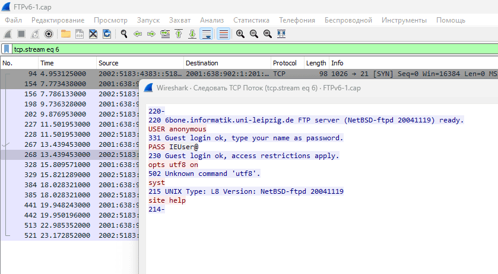
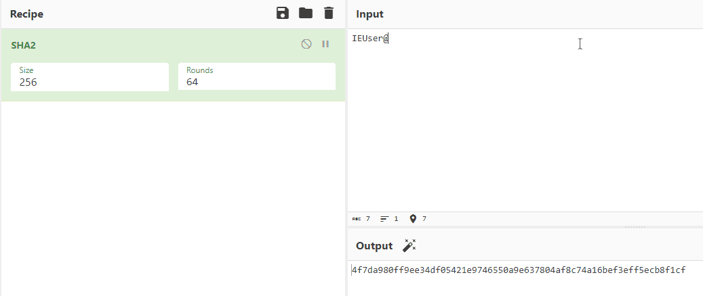

# Задача №1

### Ход выполнения

1. Открыть `FTPv6-1.cap` в Wireshark.
2. Найти пакеты, идущие по протоколу FTP.
3. ПКМ по пакету -> Follow -> TCP Stream.
    - 
4. Увидеть логин и пароль.
5. Захешировать пароль.
    - 

[Назад](README.md)