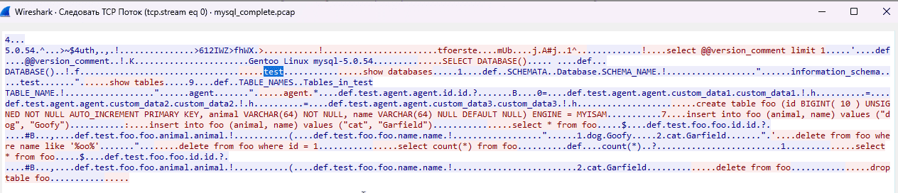
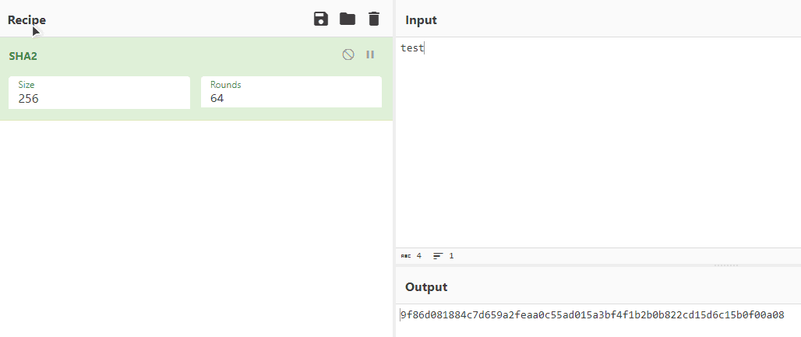

# Задача №2

### Ход выполнения

1. Открыть `mysql_complete.pcap` в Wireshark.
2. Найти пакеты, идущие по протоколу MySQL.
3. ПКМ по пакету -> Follow -> TCP Stream.
    - 
4. Увидеть название базы данных.
5. Захешировать название базы данных.
    - 

[Назад](README.md)