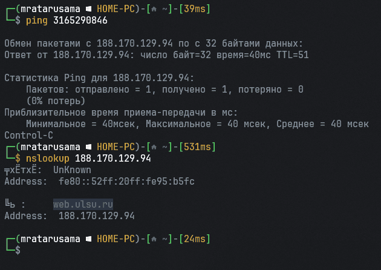

# Задача №3

### Ход выполнения

1. Отправить `ping` на предоставленный адрес (`3165290846`)
    - Также можно просто перевести адрес из десятичной системы в 256-ричную. Например, с помощью Python:
    ```python 
    addr = 3165290846
    print('.'.join([str(addr // 256**i % 256) for i in range(3, -1, -1)]))
    # Выведет "188.170.129.94"
    ```
2. С помощью nslookup получить имя хоста.
    - 

[Назад](README.md)