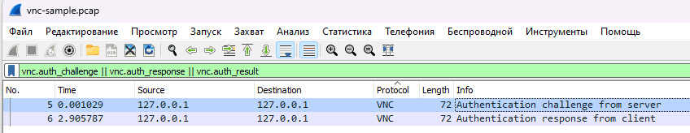
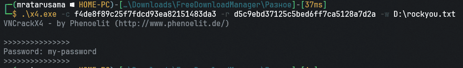
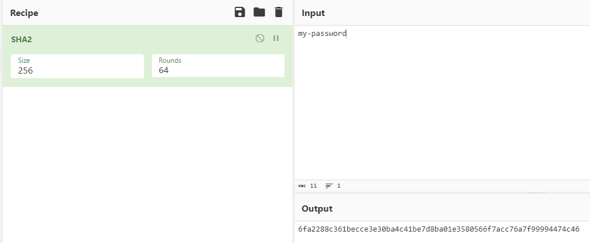

# Задача №7

### Ход выполнения

1. Открыть `vnc-sample.pcap` в Wireshark.
2. Отсортировать пакеты с помощью фильтра `vnc.auth_chellenge || vnc.auth_response || vnc.auth_result`.
    - 
3. Подобрать пароль, используя найденные хеши `chellenge` и `response` с помощью [x4.exe](http://www.ph33rinc.net/phenoelit/phenoelit-us.org/vncrack/download.html) по словарю `rockyou.txt`. 
    - 
4. Захешировать пароль в SHA256.
    - 

[Назад](README.md)