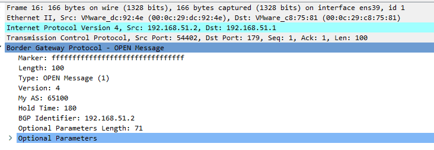
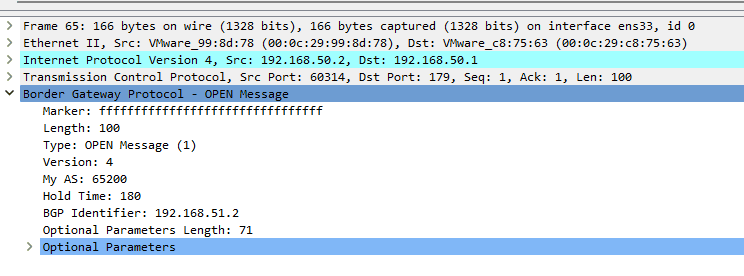

# Задача №8

### Ход выполнения

1. Открыть `bgp.pcapng` в Wireshark.
2. Найти пакеты, идущие по протоколу BGP.
3. В пакетах по полю `My AS` увидеть номера автономных систем.
    - 
    - 

[Назад](README.md)