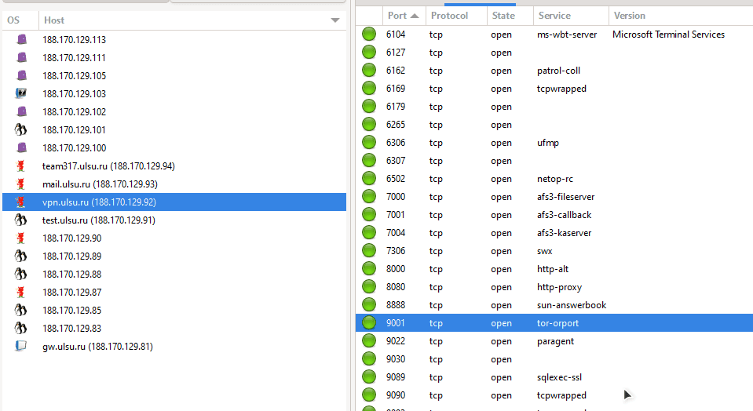

# Задача №9

### Ход выполнения

1. Понять, что все ip УлГУ начинаются с `188.170.129.*`
2. Просканировать все ip из диапазона `188.170.129.0/24`
3. Сузить область поиска до `188.170.129.81-113`, т.к. ip адреса выше и ниже этих принадлежат другим организациям. (судя по доменому имени)
    - 
4. Просканировать все порты на этих ip адресах.
5. Найти подозрительный порт `9001`, использующий протокол `tor-orport` на ip `188.170.129.92`.
    - 
6. С помощью комбинаций `ssh-keyscan` и `ssh-keygen` получить отпечаток.
    ```bash
        ssh-keyscan -t ed25519 188.170.129.92 | ssh-keygen -lf -
    ```
    - 

[Назад](README.md)